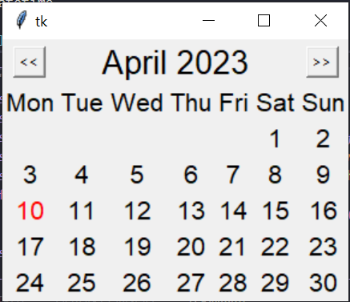
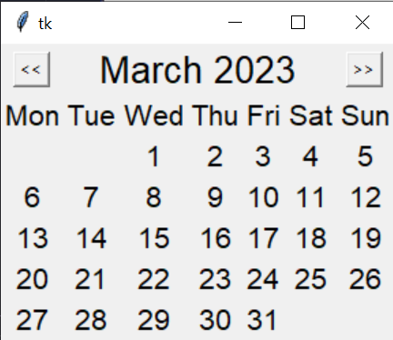

# Advanced Calendar Application

Name: Ramkumar Murthy

### Source Code:

```
""" Created by : Ramkumar Murthy """
import tkinter as tk
import datetime

class CalendarApp:
    def __init__(self, master):
        """ Initialization """
        self.master = master
        self.current_date = datetime.date.today()
        self.month_label = tk.Label(master, text=self.current_date.strftime("%B %Y"), font=("Arial", 20))
        self.month_label.grid(row=0, column=0, columnspan=7)
        self.days_of_week = ["Mon", "Tue", "Wed", "Thu", "Fri", "Sat", "Sun"]
        for i, day in enumerate(self.days_of_week):
            label = tk.Label(master, text=day, font=("Arial", 16))
            label.grid(row=1, column=i)
        self.refresh_calendar()
      
        prev_button = tk.Button(master, text="<<", command=self.prev_month)
        prev_button.grid(row=0, column=0)
        next_button = tk.Button(master, text=">>", command=self.next_month)
        next_button.grid(row=0, column=6)
      
    def refresh_calendar(self):
        """ Update Calender """
        month_start = datetime.date(self.current_date.year, self.current_date.month, 1)
        month_end = month_start.replace(day=28) + datetime.timedelta(days=4)
        month_end = month_end - datetime.timedelta(days=month_end.day)
        num_days = (month_end - month_start).days + 1
        start_day = month_start.weekday()
        for i in range(num_days):
            day_label = tk.Label(self.master, text=i+1, font=("Arial", 16))
            day_label.grid(row=2 + (i+start_day)//7, column=(i+start_day)%7)
            day = datetime.date(self.current_date.year, self.current_date.month, i+1)
            if day == datetime.date.today():
                day_label.config(foreground="red")
      
    def prev_month(self):
        """ Switch to Previous Month """
        self.current_date = self.current_date.replace(day=1) - datetime.timedelta(days=1)
        self.month_label.config(text=self.current_date.strftime("%B %Y"))
        for widget in self.master.grid_slaves():
            if int(widget.grid_info()["row"]) > 1:
                widget.destroy()
        self.refresh_calendar()
      
    def next_month(self):
        """ Switch to Next Month """
        self.current_date = self.current_date.replace(day=28) + datetime.timedelta(days=4)
        self.current_date = self.current_date - datetime.timedelta(days=self.current_date.day)
        self.month_label.config(text=self.current_date.strftime("%B %Y"))
        for widget in self.master.grid_slaves():
            if int(widget.grid_info()["row"]) > 1:
                widget.destroy()
        self.refresh_calendar()
      
root = tk.Tk()
app = CalendarApp(root)
root.mainloop()

```

Output ScreenShots:




